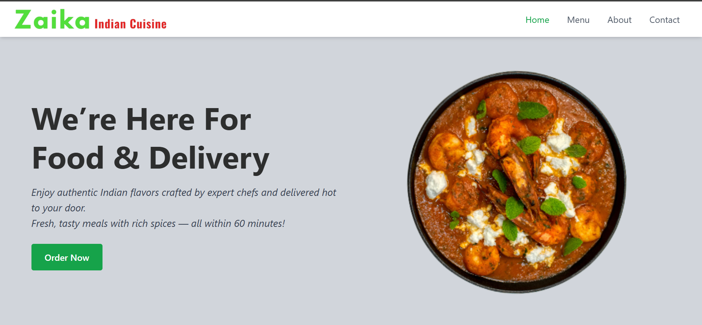

# Zaika Restaurant Website
A modern and responsive restaurant website that showcases menu items, allows online ordering, and provides information about the restaurant. Built using React for frontend and Node.js/Express with MongoDB for the backend.

## Live Demo
https://www.zaika.us.com/

## Features
- Browse restaurant menu and categories  
- Online ordering and cart management  
- Responsive and mobile-friendly design  
- Admin features for managing menu items and orders  
- Clean and intuitive user interface  

## Screenshot
  

## Technologies Used
### Frontend
- React.js  
- Vite  
- Tailwind CSS  
- JavaScript    
- Vercel Deployment  

### Backend
- Node.js  
- Express.js  
- MongoDB  
- Mongoose  
- JWT Authentication  

## Folder Structure
### frontend/
- public/  
- src/  
  - assets/  
  - components/  
  - pages/  
  - App.jsx  
  - index.css  
  - main.jsx  
- index.html  
- package.json  
- tailwind.config.js  
- vite.config.js  

### backend/
- assets/  
- config/  
- middleware/  
- models/  
- package.json  
- server.js  

## How to Use
1. Visit the live website  
2. Browse menu items and categories  
3. Add items to cart and place an order  
4. Admin can manage menu and orders  

## What I Learned
- Full-stack development with React and Node.js  
- Connecting frontend with backend APIs  
- Managing database operations with MongoDB  
- Component-based UI design with React  
- Responsive layouts using Tailwind CSS  
- Handling deployment for frontend and backend  

## Author
**Shruti Rawat** 
Web Developer
